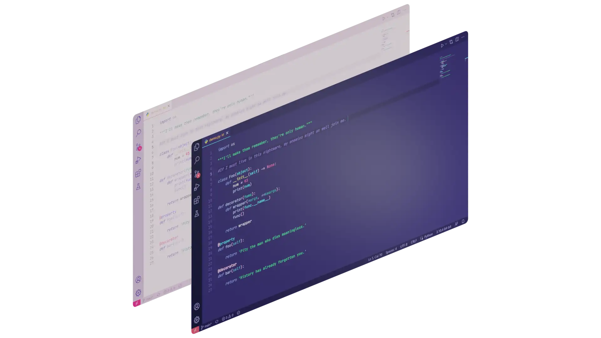
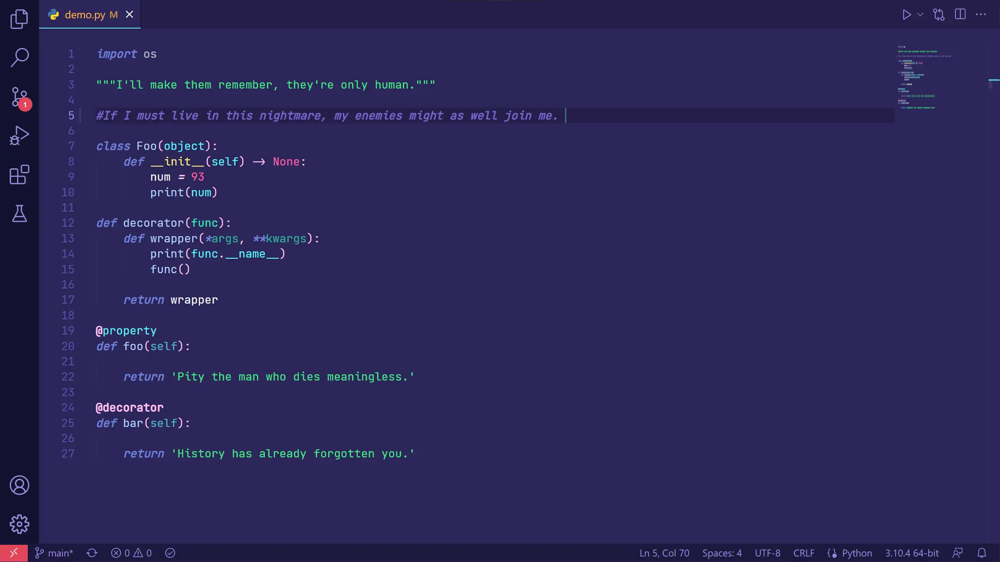
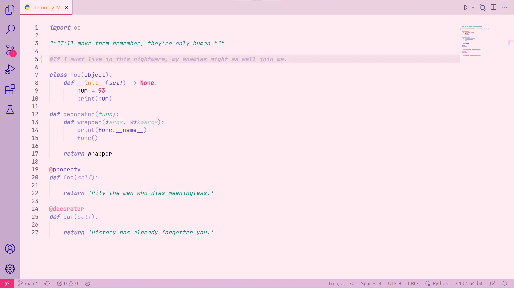

<h1 align='center' style='border-bottom-color : #4c3f88; color : white'>omen</h1>

 
 

THIS THEME IS A WORK-IN-PROGRESS; REPORT ANY ISSUES <a href='https://github.com/w3n-s/vscode-omen-theme/issues/new/choose' style='color : #00d4ff'>HERE</a>

This is theme for Visual Studio Code that was originally inspired by Omen, from Valorant. Currently this theme features one dark mode (Omen--Nightmare) and one light mode (Omen--Lightmare) theme.

 

 
 

<h2 align='center' style='font-weight : bold; color : white'>PREVIEWS</h3>

Omen--Nightmare

 
 

Omen--Lightmare

 

<b style='color : white'>Enjoy the theme!</b>
 
 

