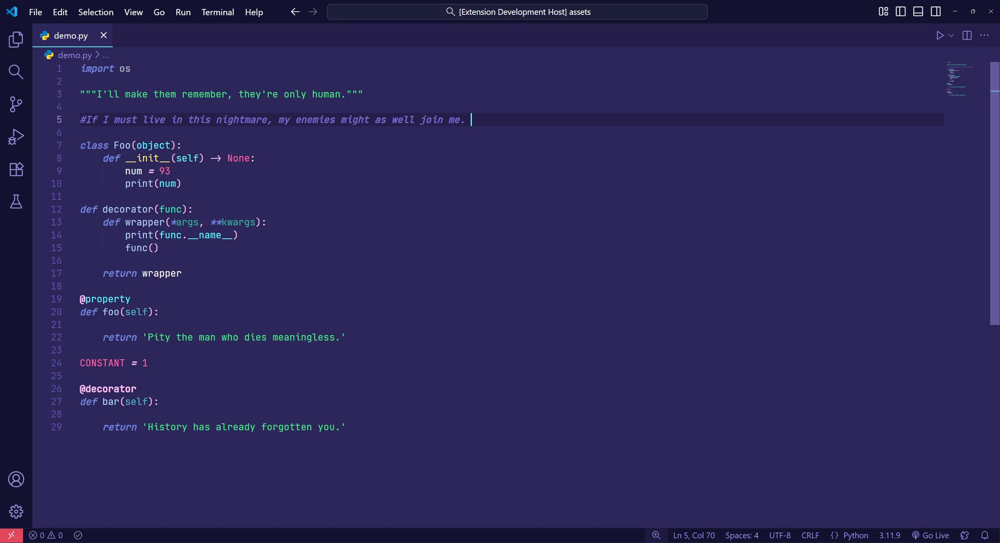
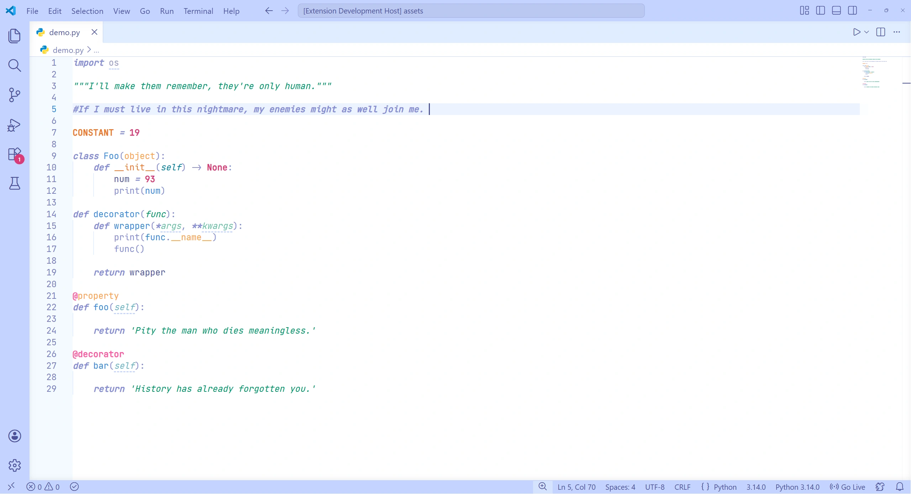

 
 

This is a theme for Visual Studio Code that was originally inspired by Omen, from VALORANT. The theme evolved from there into something separate of my own, keeping some reference to the character but being my own theme and colour preferences.
 
 
There are two themes: Nightmare and Daydream for both dark mode and light mode respectively. The themes were made around Python specifically, so if you think something doesn't look quite right please report it using the link below :3

<h2 align='center' style='font-weight : bold; color : white'>PREVIEWS</h3>

Omen—Nightmare

 
 

Omen—Daydream

 

REPORT ANY ISSUES WITH THE THEME <a href='https://github.com/w3n-s/vscode-omen-theme/issues/new/choose' style='color : #00d4ff'>HERE</a>

<b style='color : white'>Thank you!</b>
 
 

