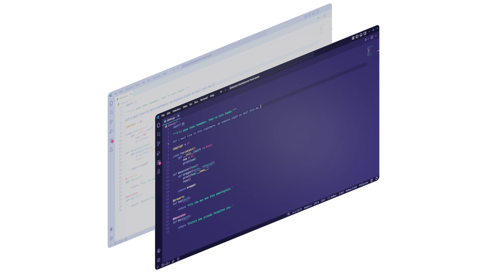
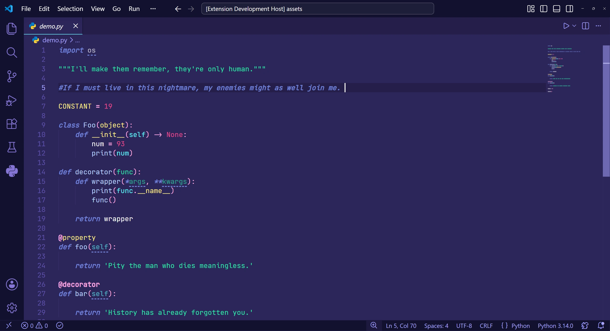
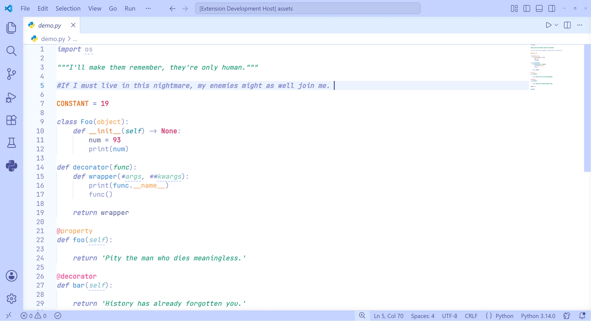
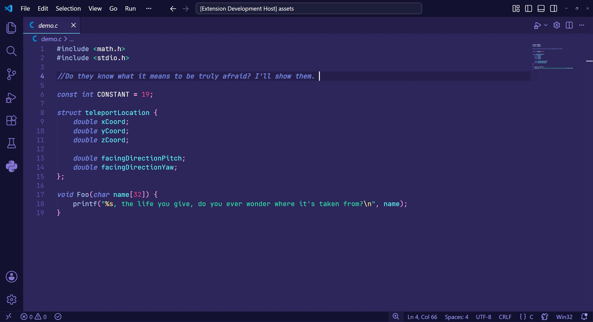
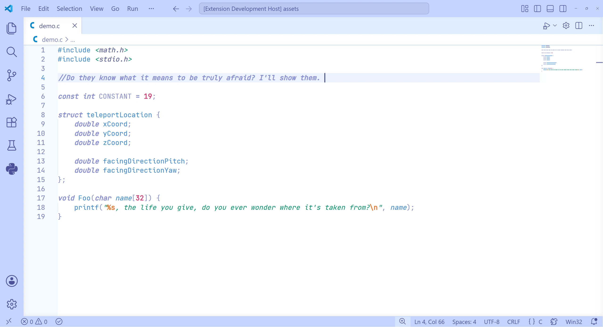

 
 

This is a theme for Visual Studio Code that was originally inspired by Omen, from VALORANT. The theme evolved from there into something separate of my own, keeping some reference to the character but being my own theme and colour preferences. There are two themes: Nightmare and Daydream for both dark mode and light mode respectively.
 
 
I have only tested and used the themes myself in the Python and C programming languages. If you program in other languages and you notice anything out of the ordinary, you can use <a href='https://github.com/m-mikapika/vscode-omen-theme/issues/new/choose' style='color : #29E6A7'>this link</a> to report or suggest the changes :3

<h2 align='center' style='font-weight : bold; color : white'>PREVIEWS</h3>

Omen—Nightmare in Python

 
 

Omen—Daydream in Python

 
 

Omen—Nightmare in C

 
 

Omen—Daydream in C

 

<b style='color : white'>Thank you!</b>
 
 

